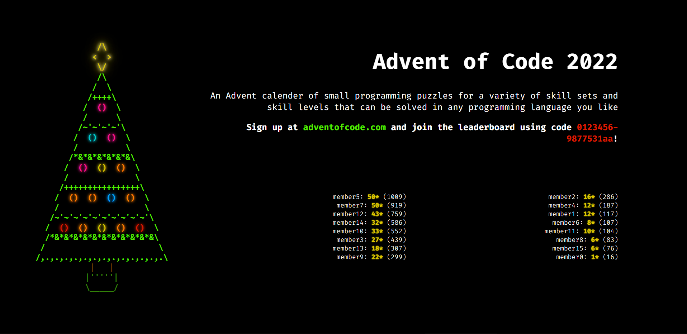

# Advent of Code Board
An Advent of Code leaderboard for sticking up on a wall/screen somewhere and encourage some gentle competition 😁

## Screenshots
### Promoing the event without an invite code set

### Promoing the event with an invite code set

### Leaderboard during the event

## Setting up
### API
* Add Advent of Code leaderboard owner ID and session cookie data to `.env`.
* Run `composer install` to install dependencies.
* Copy api folder to server.

If not serving the api folder through apache then you will need to setup your http server to prevent config/build files being readable.

### React app
* Add public url (and leaderboard invite code if you want to display that) to `.env.local`.
* Run `npm run build` to build the app.
* Copy the build folder to wherever you're hosting this thing and you're good to go 👍