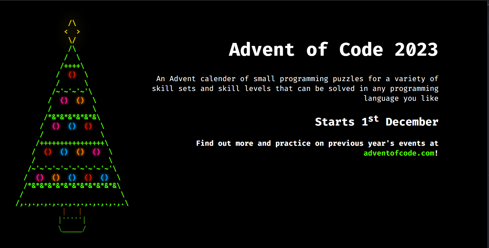

# Advent of Code Board
An Advent of Code leaderboard for sticking up on a wall/screen somewhere

A bit of a WIP - currently shows info about the AOC and your leaderboard code so people can join (and also a Christmas tree with tappable baubles).

It will eventually pull the leaderboard and show it alongside.

## Setting up
### API
Need to add info to `.env` and `composer install` to pull third party libraries. If not serving through apache then will need some modifications to prevent config/build files being readable.

### React app
Add public url (and leaderboard invite code if you want to display that) to `.env.local`, then `npm run build` to build the app. Copy the build folder to wherever you're hosting this thing and you're good to go 👍

## Preview
### Before the event starts

### With an invite set

## TODO
* ~~modify retrieved API data to output cleaner datasets to display on leaderboard~~
* ~~modify cache script to work out which year and create correct URL from that and provided ID~~
* `Leaderboard` component - pull modified API data and display in two tables ('most stars' and 'latest activity')
* handle errors in API data - display a small ! bottom right of screen that can be tapped to reveal more
* test the crossover from November to December swaps to displaying the leaderboard properly so don't need to faff with it then
* add setup instructions above...
